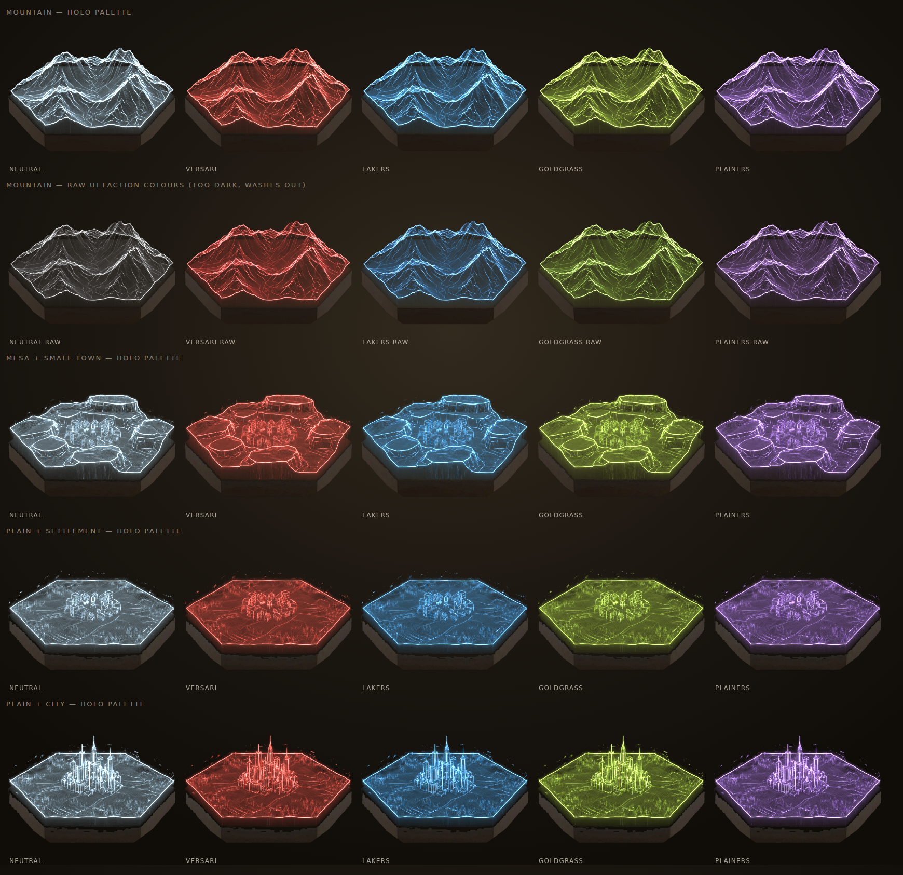
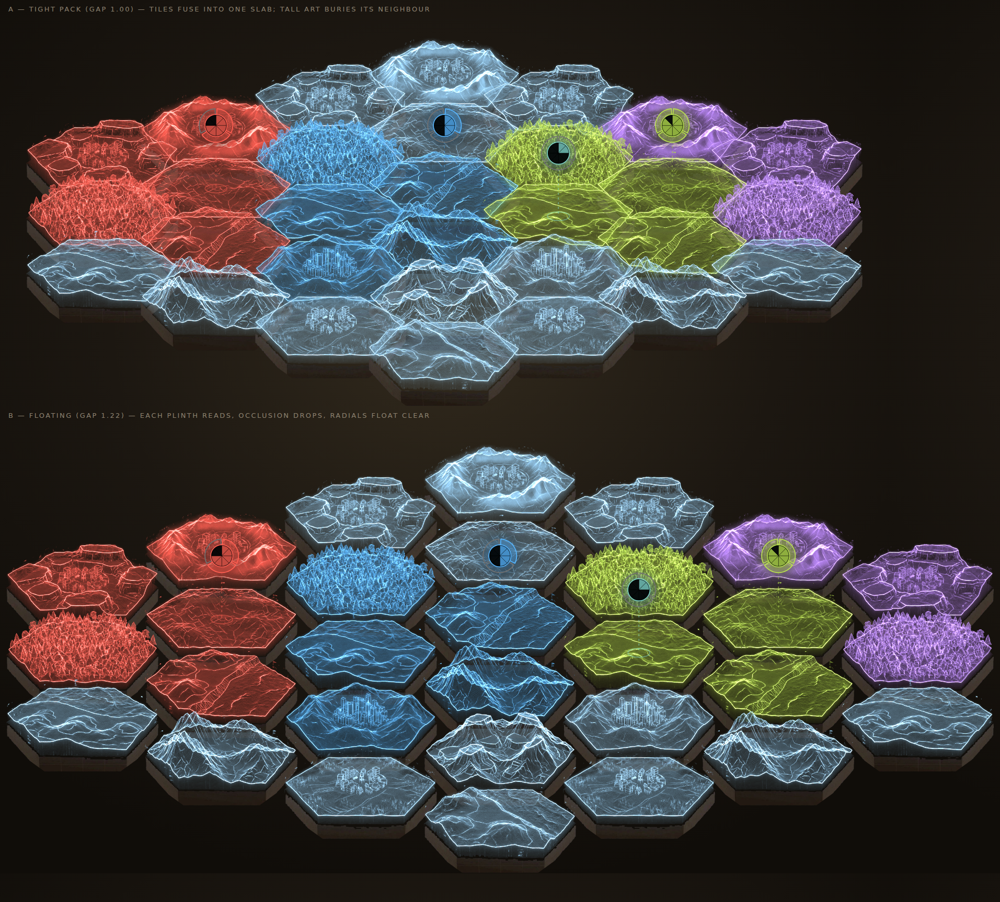
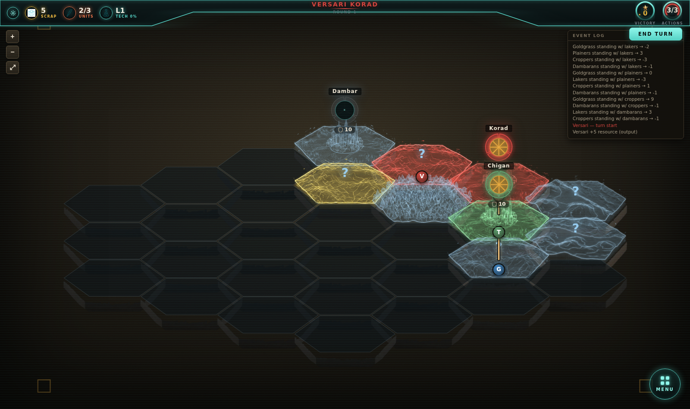
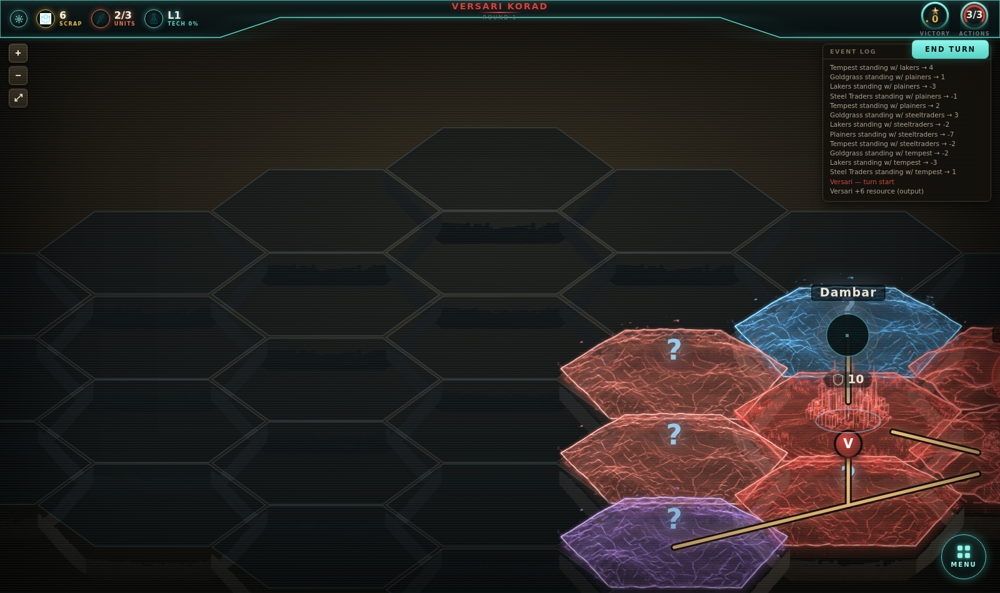

# Holographic Hex Board — Integration Plan

Turning the 16 hologram hex renders (now `art/hex-tiles/masters/`) into the
live game board, with the hologram recoloured per controlling faction, and the
Loyalty radial lifted off the tile to float above it.

Status: **built and running.** Phases 0–8 below are implemented; the board is
live behind `?board=holo` (the default) with `?board=flat` still rendering the
old one for comparison on the same save. Phase 8's structural half is done and
measured (§7); its frame-time half needs a real browser. The long tail in §5 is
not done. Open questions are in [Decisions](#6-decisions).

---

## 1. What the art actually is (measured, not eyeballed)

Measured, and re-measured twice after the first two answers turned out to be
confidently wrong:

| Property | Value | Notes |
|---|---|---|
| Canvas | 1024 × 1024 JPEG | opaque, no alpha |
| Near edge of the ground hexagon | **544 px** at y 692 | fitted from the flanks |
| Far edge of the ground hexagon | **410 px** at y 316 | **25% shorter than the near edge** |
| Side vertices | **(25, 472)** and **(992, 472)** | width 966 |
| Plinth bottom (centre) | y **837** | |

**The renders are perspective, not orthographic.** That single fact caused every
tiling problem: a tile's far edge is a quarter shorter than its near edge, so
the far edge of one tile can never meet the near edge of the tile behind it.
The flat edges stay parallel but leave a wedge-shaped gap, and the slanted
edges collide at the points. No choice of pitch, spacing or vertical stretch
can fix a shape that is not centrally symmetric — which is why two earlier
attempts to re-measure the "hexagon" only traded overlap for gaps.

**The world hexagon is regular, though.** The mean of the far and near edges
(477) matches half the measured vertex-to-vertex width (483) to within 1%. So
the shape is right and only the camera is wrong, which means it can be undone.

**The fix is rectification.** The ground hexagon's four non-side vertices form
a rectangle in world space, so a homography from the measured trapezoid onto a
rectangle is an exact inverse-perspective for the ground plane.
`build_tiles.py` applies it to every master before splitting layers. Afterwards
each tile is a true regular flat-top hexagon — flat edges exactly half the
vertex width, opposite sides parallel and equal — and tiles the plane by
construction. Geometry above the ground (terrain, the plinth) is sheared rather
than correctly reprojected, which is unavoidable without depth and looks fine
at this tilt.

Rectified frame: hexW **966**, hexFlat **483**, hexH **376**, skirt **100**,
centre (700, 780) on a 1400 × 1500 canvas. `hexH` is now a free parameter — it
*is* the apparent camera elevation — rather than something to measure.

Two measurement traps worth recording, since both produced confident wrong
answers:

- **The hologram's far rim is not the hexagon's far edge.** Terrain rides above
  it, so reading the topmost rim pixel gives a peak, and reading the rim's flat
  plateau gives an edge whose ends terrain has eaten. Fit the *flanks* and
  intersect them instead.
- **The widest silhouette row is not the hexagon's centre.** A prism has
  constant width all the way down its vertical edges, so "widest row" is
  degenerate and `argmax` lands arbitrarily inside that band.

Inventory, using the author's labels (16 masters, after two coastline
additions): 1 plains, 2 forest, 3 mountain/plateau, 3 inland settlements,
2 inland cities, 3 open coastlines, 1 coastal settlement, 1 coastal city.
Three tiles I had first read as cracked plains, badlands and mesa turned out to
be **coastlines** — the labels caught that, guessing did not.

---

## 2. Recommended architecture

### 2.1 Recolour: three baked layers + a runtime tint

Do **not** hue-rotate the whole image (it drags the wooden plinth with it and
barely moves near-white pixels), and do **not** regenerate 4 coloured copies per
tile (56 files, colour drift, no smooth transitions, no contested states).

Split each rectified master, offline, into three layers:

| Layer | Contents | How it's used |
|---|---|---|
| `<tile>_base.webp` | Plinth skirt only, background keyed out | plain ``, never recoloured |
| `<tile>_holo.webp` | Hologram intensity in the **alpha** channel | CSS `mask-image` over a solid faction-colour div, `mix-blend-mode: plus-lighter` |
| `<tile>_core.webp` | Only the white-hot rim lines | ``, `plus-lighter`, ~0.6 opacity — keeps the glow reading as *hot*, not as flat paint |

Separation is deterministic — no ML, no manual masking:

- The plinth silhouette is **analytic** (locked camera + rectification ⇒ the
  prism is a known regular hexagon plus a 100 px extrusion).
- Hologram vs plinth is a two-line classifier: the hologram is cool and
  emissive (`B − R > 4`, luminance > 50), the plinth is warm and only ever lit.

Built by `scripts/hex-tiles/build_tiles.py`; the original proof is kept as
`split-spike.py`.

### 2.2 A dedicated "holo palette", not the raw UI colours

Additively tinting a white-hot glow with a mid-tone colour produces mud. The
raw `data.js` faction colours are mid-tone. Compare rows 1 and 2 of the proof
image below — same tile, same pipeline, only the palette differs.

| Faction | UI colour (`data.js`) | Proposed holo colour |
|---|---|---|
| Versari | `#d2453f` | `#ff5f52` |
| Lakers | `#3f84c4` | `#58b6ff` |
| Goldgrass | `#85ab3e` | `#b8e04e` |
| Plainers | `#9d70c4` | `#c08cff` |
| Neutral / unheld | — | `#9fd8ff` (close to as-generated) |

These live next to `FACTIONS` in `data.js` behind `holoColor(id)` so the two
palettes stay visibly related but independently tunable.

### 2.3 Board geometry: one projection module

`src/prototype/hexProjection.js` holds the measured constants and every
screen-space derivation: `buildHexGeometry(rows)`, `paintOrder(centers)`,
`topFacePolygon(inset, cx, cy)` and `tileFor(hex, value)`. `hexDims.js` stays
for the flat board, which keeps its own pointy-top geometry.

Because the art is flat-top, **engine rows render as screen columns**. Crucially
this needs no new math: `buildHexGrid` already stamps every hex with
`x = col - (width-1)/2`, which encodes the half-row interlock. So:

```js
screenX = hex.row * ((HEX_W + HEX_FLAT) / 2 * gap)
screenY = hex.x   * (HEX_H * gap)
```

The engine's adjacency graph is purely topological (`board.js:buildHexGrid`) —
it does not care which way the hexes point, so **no engine or save-format change
is needed anywhere**. This is entirely a display-layer change.

`CONFIG.testMap` is `[3,4,5,6,5,4,3]`, near-symmetric, so transposing keeps the
board roughly the same shape — it just becomes wider and shorter (~2.4:1), which
suits a widescreen viewport.

### 2.4 Absolute positioning + per-tile z-order

The current flex-rows-with-negative-margin layout can't express this. Move to a
single absolutely-positioned container, tiles placed at their projected centre,
`zIndex` assigned by sorting **every tile by screen y** (not by row — with a
flat-top grid, adjacent columns are offset by half a step, so rows no longer
share a y).

### 2.5 A dedicated hit-test layer

With heavy overlap, rectangular tile divs will steal each other's clicks. Put
one SVG on top of the board with a `<polygon>` per hex using
`topFacePolygon()`, `fill="transparent"`, carrying all pointer events. Tiles
themselves become `pointer-events: none`. This also fixes hover precision and
makes the ZoC ring and the hit target the same shape by construction.

### 2.6 The floating Loyalty radial

Render `ControlMeter` into a **separate overlay layer above all tiles**, at the
tile's centre lifted ~300 source-units upward, plus:

- a dashed vertical **tether** down to the tile, and
- a small **ground ellipse** on the top face where the tether lands.

The tether and ellipse are what keep it attached — without them a floating
circle just reads as UI clutter. The meter stays a true circle (it is *not*
squashed by the projection), which is what sells it as a billboard hovering in
3D space.

Consequence to accept deliberately: in the overlay layer, a nearer tile never
occludes a farther tile's meter. That costs a little depth realism and buys
guaranteed legibility. I think that's the right trade for a meter you have to
read every turn.

### 2.7 Fog of war gets better, not worse

The hologram fiction maps onto `hex.fog` almost for free:

- `unexplored` → plinth only, projector off (base layer, no holo layers).
- `explored` → holo layers at low opacity, desaturated toward neutral: a stale
  recording.
- `visible` → full tint.

This is a genuine upgrade over the current black/50%-dim treatment.

### 2.8 Roads and rails ride over the tiles

Roads connect **settlements**, not just capitals: every Location is road-linked
to its nearest neighbour, and `high`/`veryHigh` ones also to their second
nearest, with cluster-bridging links added afterwards so the network is always
connected (`assignRoads`, `CONFIG.roads.linksByValue`). That takes the network
from ~11 road hexes of 30 to ~17, and it is what gives the blockade design its
teeth — "an uninterrupted road connection to the nearest owned settlement"
(rail/blockade doc §3) only means something if such a connection exists.

`hex.road` is a per-hex boolean, not an edge list, so `routeGeometry.js`
recovers a drawable network by linking each road hex to its road neighbours —
re-deriving adjacency with the engine's own rule rather than from screen
distance, so it survives any projection change — and then walks that network
into **chains** running junction to junction, which is the unit everything
downstream works in (§10).

Two things decide how they're drawn. The background is never the same colour
twice (a route crosses hexes glowing in whatever colour their owner is), so
every route gets a **dark trough** under its core — the standard cartographic
casing trick — and is legible over any tint. And the two types are
distinguished by more than hue: roads are one worn amber line, rails carry
cross-ties, which survives both a recolour and colour-vision deficiency.

Routes stop short of a Location's centre, cut where each one crosses a keep-out
ellipse that matches the board's vertical squash, so the clearance reads as
circular on the projected ground.

Layer order is tiles → routes → tokens → radials → hit layer. Getting tokens
above the routes is why they moved out of `HexTile` into `BoardTokens.jsx`: a
tile is its own stacking context, so nothing inside one can rise above a
sibling tile.

---

## 3. What's already proven

Both images below were produced by the spike scripts in `scripts/hex-tiles/`
running on the real assets.

### Recolour works



Four tile types × five palettes. The plinth stays warm wood in every cell; only
the hologram takes the faction colour. Row 2 is the same tile with the raw UI
colours — visibly darker and muddier, which is the evidence for §2.2.

### The board reads



A full 30-hex `testMap` on the flat-top grid, tinted by territory. **A** is
tight-packed (gap 1.00), **B** is floating (gap 1.22).

Territory-by-hologram-colour is instantly legible at a glance — the core idea
works. Tight packing fuses the tiles into an unreadable slab and tall art buries
its neighbour; floating gives every plinth a silhouette and drops occlusion a
lot. **I recommend B.**

Also visible in the mock, and worth looking at closely: tile repetition. 14
tiles over 30 hexes puts duplicates side by side in places.

### …and here it is running



The real thing, turn 1 of a 30-hex `testMap`, with fog, packed at `GAP = 1.0`.
Unexplored hexes keep an unlit plinth so the board's extent still reads;
territory is Versari red, Goldgrass green, Croppers yellow, Plainers purple,
unheld ground cyan. The Loyalty radials hang above their Locations on a dashed
tether, and the road network runs over the tiles and under the unit tokens.



---

## 4. Implementation phases

Each phase is independently shippable and leaves the game working.

| # | Phase | State | Where it landed |
|---|---|---|---|
| 0 | Asset pipeline | done | `scripts/hex-tiles/build_tiles.py` → 42 layers + `src/prototype/hexTiles.json`. Masters moved out of `public/` to `art/hex-tiles/masters/` so they stop shipping; output is 2.44 MiB of WebP for all 14 tiles. |
| 1 | Projection module | done | `hexProjection.js`. `CameraController.buildHexGeometry` takes a `{holo}` flag and delegates, so the replay camera pans to the right hex on either board. |
| 2 | `HexTile` component | done | `HexTile.jsx` — three-layer stack, tint, fog, tokens, rings, road, loot. |
| 3 | Board rewrite | done | `HexBoard3D.jsx` — absolute placement, y-sorted z-index, SVG hit layer. |
| 4 | Re-site the overlays | mostly | Unit tokens, ghosts, ZoC ring, road, encounter mark and loot are all on the projected top face. The terrain elevation/cover badge was dropped: the art now says it. |
| 5 | Floating radial | done | `FloatingControlMeter.jsx` — tether, contact ellipse, unsquashed billboard. |
| 6 | Tint source of truth | done | `holoTint.js` + `holoColor` in `data.js`; 0.45s colour transition on control flips, contested pulses. |
| 7 | Fog treatment | done | Unexplored = plinth with an unlit top face; explored = projection at 0.34. |
| 8 | Perf + LOD pass | done (structurally) | `boardLod.js` + `FlatTileLayer.jsx`; `MIN_SCALE` 0.45 → 0.26. Measured by `npm run board-perf`. Frame time still unprofiled — see §8. |

The flag is `?board=holo` / `?board=flat` (remembered in localStorage under
`pc.board`, default holo), so both boards run against the same save until the
new one is unambiguously better.

---

## 5. Pitfalls

Ordered roughly by how much damage each does if it's discovered late.

**P1 — Orientation mismatch (structural).** The art is flat-top; the board, the
CSS clip-path, the token slots, the ZoC polygon and the replay camera all assume
pointy-top. Every one of those has to move together. The engine is unaffected.

**P2 — Occlusion (measured).** Tall geometry reaches up to 332 px above the hex
centreline against a 469 px vertical pitch, so a tall tile hides roughly the
back two-thirds of the tile behind it at `GAP = 1.0`. Accepted (Q3).

**P3 — Lossy masters.** JPEG ringing around the glow leaves faint speckle in the
alpha mask. The analytic prism mask keeps it out of the plinth, but PNG/WebP
masters would produce visibly cleaner edges.

**P4 — Palette.** Covered in §2.2. Additional risk: Versari red and Goldgrass
green are the two hardest to tell apart for the most common colour-vision
deficiencies, and they are adjacent on the map. The tint should not be the
*only* ownership cue — keep a shape or pattern cue (the rim, the radial) as
backup.

**P5 — Overlay re-siting is the long tail.** `Hex.jsx` has seven separate things
positioned in flat-hex percentage coordinates: unit tokens (5 slots), ghost
tokens, the ZoC dashed ring, the ZoC area tint, the road band, the terrain
badge, and the loot marker. Every one needs projected coordinates. Budget real
time for this; it's more work than the tinting.

**P6 — Baked art has no depth buffer.** A unit token "standing on" a mountain
summit will float or sink, because nothing knows how tall the terrain is under
it. Practical answer: place tokens on the **front apron** of the top face, where
the ground plane is reliable across all 14 tiles, with a contact ellipse. Don't
try to place them on the terrain surface.

**P7 — Draw order.** Must be per-tile by screen y, not per-row. The existing
`zIndex: rowIdx` hardening in `HexBoard.jsx` becomes wrong, not just redundant.

**P8 — Variety.** 14 tiles across 30 hexes (more on larger maps) repeats
visibly. A horizontal flip would double the pool to 28 cheaply — the lighting in
these renders looks close to frontal, so flipping is *probably* safe, but it
needs an eyeball check before relying on it.

**P9 — Missing tile types.** Coastlines have landed (5 of them). Still no
rubble/wetland, though `docs/content-schema-v0.1.md` anticipates them and
`hex.terrain` already exists in the engine (currently always `null`). Roads and
rails are drawn as a **vector network over** the tiles rather than as
edge-socket art (§2.8), so they need no new tile variants — but they also do
not blend into the terrain they cross.

**P10 — Stale prep work.** *Resolved:* `src/prototype/hexArt.js` was built on the
assumption of *per-faction* art sets chosen by a static region BFS, a premise
generic art plus a runtime tint made obsolete. Nothing imported it; deleted.
`docs/blender-hex-tile-pipeline.md` still needs reconciling — the delivered art
contradicts three of its locked specifications (orientation, camera elevation,
alpha), and its "Art resolver" section describes the file that just went.

**P11 — Performance.** Per tile: 2 images, 1 masked div, 2 blend-mode layers,
its own stacking context. At 30 hexes this is fine; on a larger map with 120 it
needs the LOD in phase 8 — now built, and §7 has the measured numbers. Bake glow
into the layers rather than using CSS `drop-shadow`, which is the expensive one;
the ring glow in `HexTile` and the two stacked shadows on each floating radial
are the remaining users of it.

**P12 — Browser support.** `mix-blend-mode: plus-lighter` needs Firefox 113+;
older Firefox needs a `screen` fallback. CSS masks still want `-webkit-` prefixes
for Safari. Also noted from the spike: masks referencing local files are blocked
on `file://` origins — irrelevant to the dev server and to production, but it
will silently break for anyone who opens a built `index.html` directly from disk.

**P13 — Zoom range.** *Resolved.* `MIN_SCALE` is 0.26 — the mush it used to
guard against is now the LOD's job, and 0.45 could not fit a huge board on a
1280-wide viewport (§7). `MAX_SCALE` stays 2.4, which is right against a 1024 px
source.

**P14 — Encounter and wasteland hexes.** The `?` glyph and the "Wasteland" label
are flat-board idioms. They need a hologram-native treatment (a glitching
projection, an unresolved wireframe) or they'll look pasted on.

---

## 6. Decisions

### Settled

- **Q1 Orientation — transpose.** Engine rows render as screen columns; the art
  stays flat-top and is not re-rendered for orientation.
- **Q2 Spacing — packed, `GAP = 1.0`.** Plinths meet and the board reads as one
  continuous map table. Tile-on-tile occlusion is accepted (Q3).
- **Q3 Camera — keep 24.8°.** Not re-rendering for the angle; a tile in front
  hiding part of the one behind it is fine.
- **Q5 Tint source — split.** Location hexes tint by `controller`, terrain and
  encounter hexes by `zocOwner`, contested stays neutral with a slow pulse.
- **Q6 Plinth — uniform.** Never recoloured, no per-faction material.

### Open

- **Q3 Camera elevation — deferred, pending the cost of regenerating (Q4).**
  Not a blocker: the pipeline and the renderer both read their geometry from
  `tiles.json`, so a re-rendered set at a different elevation is a manifest
  change plus a rebuild, not a code change. Phases 0–3 proceed either way.
- **Q4, Q6–Q9** below.

### Still needed from you

**Q4 — More flat inland masters.** The single biggest visual gap now. After
tagging, the pools are: inland flat **1**, forest 2, mountain 4, town 3, city 2,
open coast 3, coast town 1, coast city 1. Flat is the pool that matters most —
`CONFIG.hexSplit` gives the map 13 encounter hexes, none of which ever carry
`elevation` or `cover`, so they all resolve flat, and every one of them draws
the same `plains_hills`. Two or three more plain/rolling inland masters would
fix roughly half the board.

**Q10 — Rail.** The design is settled in
`docs/rail-road-blockade-design.md` (I missed that doc first time round and
wrongly reported rail as undesigned — it is undesigned only in *code*). What is
missing is the implementation. `RouteNetwork.jsx` already draws rails off a
`hex.rail` field, so they appear the moment the engine stamps one. Rail is generated at
setup like roads and never changes during a game, so the renderer's
"draw once, static" assumption holds. Open items are that doc's own list —
chiefly which settlement pairs get track.

**Q11 — Should Dambar still be a Versari home Location?** Capitals are now
declared explicitly (Versari korad, Goldgrass kansit, Lakers droit, Plainers
tin-town) and all four are balanced identically, but one question survives: `src/game/content.js` lists
**dambar** among Versari's two affiliated Locations, while the fiction has
Dambar as the Denver analogue and the Dambarans plainly from there. Moving it
would leave Versari with one home Location, and `generateLayout` assumes every
major faction has exactly two — so this is a content change with a generator
consequence, not a one-line edit.

**Q12 — Should the generator force the coastal factions east?** Coast art is
positional, so Lakers (chigan + droit) and Tempest currently start wherever
`generateLayout`'s farthest-point sampling puts them, which is often inland.
Pinning their anchor to the eastern rim is a contained change to
`generateLayout`, but it is a real map-generation change — it re-rolls every
existing seed — so I have not made it.

**Q13 — Vertical stretch.** `STRETCH` in `hexProjection.js` fakes a higher
camera by scaling every vertical measurement; it is at **1.25** (reads as
~45°). 1.0 is the art exactly as rendered (~34°). It is a cheat: a real camera
lift would foreshorten tall geometry as it opened up the ground plane, and this
only does the second half, so mountains grow along with the ground. Fine at
1.25, breaks down well before 2.

**Q7 — Approve the holo palette** in §2.2, or adjust the four colours.

**Q8 — Unit tokens.** Keep them as the current 2D chips floating over the tile,
or restyle them as part of the hologram? P6 constrains where they can sit either
way.

**Q9 — Scope.** Does this replace the board everywhere (Prototype, HudShowcase,
the AI replay), or ship behind a flag first? *My recommendation: flag.*

---

## 7. Level of detail (phase 8)

Below **0.62** zoom the tile layer stops being 127 pieces of art and becomes one
SVG with a flat tinted polygon per hex (`FlatTileLayer.jsx`); above **0.68** it
goes back. The gap between the two numbers is hysteresis — a wheel notch is
1.15× and can never land inside it, but a continuous pinch-zoom can, and without
the gap it would flip the whole tile layer on every pointer frame. The level is
exposed as a quantized string through a context (`boardLod.js`), not as the raw
scale, so ordinary panning and zooming re-render nothing.

Only the *tile* layer swaps. Routes, tokens, radials and hit polygons are vector
already and are drawn identically at both levels. Tint and ring both come from
`holoTint.js`, shared by the two paths, so nothing appears to change hands when
you cross the threshold.

`?lod=full` / `?lod=flat` pins one level, the way `?board=` pins a renderer.

### What it actually saves

`npm run board-perf` (with `npm run dev` running) measures this. Counts are over
the `.pc-board3d` subtree at 1600×950, seed 424242, fog fully revealed:

| map | hexes | | nodes | imgs | blend | masked |
|---|---|---|---|---|---|---|
| small | 30 | full | 546 | 60 | 60 | 30 |
| | | flat | **397** | **0** | **0** | **0** |
| medium | 61 | full | 837 | 122 | 122 | 61 |
| | | flat | **533** | **0** | **0** | **0** |
| large | 91 | full | 1113 | 182 | 182 | 91 |
| | | flat | **659** | **0** | **0** | **0** |
| huge | 127 | full | 1427 | 254 | 254 | 127 |
| | | flat | **793** | **0** | **0** | **0** |

Every `mix-blend-mode` layer and every CSS mask goes to zero — those are the two
things P11 and P12 call out as expensive, and they are the entire reason for the
swap. Node count drops by 40–45%; the remainder is routes, tokens, radials and
the hit layer, none of which the LOD touches.

Two things fell out of measuring rather than being planned:

- **The turn-1 numbers understate the board by about half.** Fog suppresses the
  hologram layers, so an unexplored hex draws its plinth and nothing else. The
  fully-explored huge board is 254 blend layers and 127 masks, which confirms
  the earlier estimate exactly. `board-perf` reveals fog before measuring.
- **`MIN_SCALE` was hiding a real bug on large boards.** A huge map's content
  box is 2365 × 1747: fit-to-view wants 0.50 at 1600×950, but 0.42 at 1280×800
  and 0.32 at 900×600. At the old 0.45 floor, any viewport 1280 wide or narrower
  simply could not fit the whole board, and "recenter" silently did nothing.
  Now 0.26.

### Still open

- **Frame time is still unmeasured.** Headless Chromium's rAF cadence is not a
  real compositor and reported a 127-hex board as *faster* than a 30-hex one, so
  `board-perf` deliberately reports no timing at all. Profile in a real browser;
  `?lod=full` exists so the worst case can be held on screen while you do.
- **Large and huge maps now open in flat LOD**, because they fit at 0.573 and
  0.50 — both under the threshold. That is the LOD doing its job, but it does
  mean the art only appears once you zoom in. If that reads wrong, `FLAT_BELOW`
  in `boardLod.js` is the one number to change.
- **`FloatingControlMeter` is the densest thing left**, ~22 nodes each and two
  stacked CSS `drop-shadow` filters — the effect P11 names as the expensive one.
  Content-capped at 10, so it is not urgent, and dropping the glow when zoomed
  out is a look decision rather than a perf one.

## 9. Routes as part of the hologram (2026-08-18)

Roads and railways read as clip-art laid over the board: one flat opaque
stroke each, on terrain that is otherwise a glowing translucent wireframe. The
lines had no relationship to the thing they crossed.

They are now a STACK of strokes rather than a single line, and the stack has
three jobs that pull against each other:

- **trough** — three wide, progressively darker strokes. This is the
  legibility guarantee, and it is why the original was stark: a route crosses
  hexes glowing in whatever colour their owner is, so without something dark
  underneath the bright core has no reliable contrast. Widened and given a soft
  falloff so it reads as ground worn into the terrain rather than an outline
  drawn around a line.
- **halo** — a wide, faint wash in the route's own colour.
- **core** — the thin bright line, no longer at full opacity.

The halo and core are painted with `mix-blend-mode: screen` so they ADD light
like everything else on this board instead of covering what is beneath.

That forces a **two-layer split**, and it is load-bearing rather than
tidiness: `mix-blend-mode` only blends within its own stacking context, and a
positioned, z-indexed layer creates one — so a screened stroke inside a single
SVG would blend against that SVG's own transparent backdrop and change
nothing. The light lives in its own element with the blend mode on the
element. The trough has to stay out of it: screening something dark is a no-op.

**LOD.** The soft falloff and the screened glow are invisible below the
threshold, where a hex is under ~130 px and a route is a few pixels wide — so
zoomed out, routes collapse to one casing plus one core in a single
normally-composited layer. This keeps §7's flat-LOD promise of **zero blend
layers** intact, and the flat path is now slightly CHEAPER than what it
replaced (huge, explored, flat: 977 → 949 nodes) because both route kinds draw
two strokes where rail used to draw three.

At full detail the effect costs one full-screen blend layer (254 → 255 on a
huge board — all the others are per-hex) and about 15% more DOM nodes, all of
them plain `<line>`s.

### Road and rail on the same ground

A settlement served by both looked rail-only: the two were drawn on the same
centre line and whichever painted last won. Segments carried by both kinds are
detected up front, and each steps half the separation off the line so the pair
straddles the route a single line would have taken — neither looks displaced,
and both read.

The normal was measured in a fixed direction (low hex id to high) rather than
from whichever end the enumeration happened to start at, so both kinds resolve
the same perpendicular and land on opposite sides instead of stacking. That
much held; §10 replaces the id ordering, which flips at a bend, and extends the
separation through junctions and settlements where the pair used to converge.

`check-board-layers.mjs` walks both cores as drawn and asserts the two never
run alongside each other in contact — a level crossing may touch, a shared run
may not.

### Paint order, and where a blockade sprite goes

Measured rather than assumed, and locked by `scripts/check-board-layers.mjs`:

| layer | z-index |
|---|---|
| route trough | 7990 |
| route light (screened) | 8000 |
| blockades | 8010 |
| hex hit targets | 8200 |
| radials | 9000 |
| unit sprites | 9200 |

So unit sprites draw above roads and railways, and a blockade draws above the
road it sits on but below the units standing on it — a unit at a blockade
reads in front of it, which is what you want.

Blockades moved into their own normally-composited layer in the same pass.
They were previously drawn inside the single route SVG, which would have put a
future blockade sprite *inside the screened light layer* and made it glow like
a road instead of sitting on one. A blockade is a solid object, not more
light. When real sprite art arrives it drops into that layer with the ordering
already correct.

## 10. Routes as ground, not lines (2026-08-21)

§9 made the routes part of the hologram; they were still *lines*. Three
complaints, all of them the same root cause — drawing SEGMENTS instead of
ROUTES:

1. **The joints were wrong.** Every stroke was its own `<line>` element, so
   where three roads met at a hex centre, three translucent round caps stacked
   and the junction bloomed brighter than the roads feeding it. The line was
   see-through; the knot was not.
2. **A road and a railway sharing ground stepped apart only over the segments
   they SHARED.** Where a shared stretch ended, the road jumped back to the hex
   centre inside one segment — a visible kink at exactly the point the eye is
   drawn to, plus a gap on the outside of the turn.
3. **Nothing varied.** Straight, uniform, dead-centre through every hex. That
   is what reads as "line drawn on top of the board" rather than "track worn
   into it", whatever you do to the colours.

`routeGeometry.js` is now the whole shape of the network — pure geometry, no
React, no styling — and `RouteNetwork.jsx` is styling laid over the two paths
it returns.

### Chains, not segments

The network is walked into chains that run from one junction (or dead end, or
Location) to the next. A chain becomes exactly one subpath, fitted with
Catmull-Rom through every point, so a route crossing six hexes is one
continuous stroke rather than six with five joints in it. Tension is 0.82
rather than 1: a 60° turn — the tightest this grid can produce — overshoots at
full Catmull-Rom and the road bulges outside the hex it is turning in.

**One path per kind, not one element per segment, is load-bearing at these
opacities.** An SVG stroke is a single paint operation: where a path crosses
itself or three chains meet, its translucent stroke does not stack. Separate
elements do. That one change is what fixed the bright knots, and it takes the
route layers from hundreds of `<line>`s to ten `<path>`s.

### Wander

Each hex edge carries hashed sample points, and each crossing point is drifted
off the hex centre by a hashed amount. Roads wander freely (a track worn by
use); railways barely at all (surveyed, and the small drift they get is only
what keeps them from looking ruled). The core is also drawn with a long,
irregular dash so the surface reads as patchy rather than painted.

Everything is hashed off hex ids — never rng'd, never time-based — so a road
lies in exactly the same place on every frame, reload and machine. A route that
reshuffled between renders would be worse than a straight one.

### Keeping road and rail apart

Separation is 17px centre to centre, which clears the widest stroke of the two
put together with daylight to spare. Three things had to be got right, and the
first two were wrong before:

- **A consistent side.** An edge's normal is pinned to a fixed half-plane so it
  comes out the same from either end — but on a shared run that closes a loop,
  the returning edges point the other way round the loop and the road crosses
  to the rail's side mid-run. So each shared run is now WALKED, and every edge
  on it oriented relative to travel: left stays left, all the way round.
- **Mitre, not average.** Averaging two normals at a bend and stepping half the
  separation along it leaves the step perpendicular to neither arm, and the
  visible gap closes to `sep × cos(half the turn)` — as little as 45% of it on
  this grid, which is the two lines touching. Lengthening the step by the same
  cosine restores true perpendicular separation, exactly as mitring a stroked
  polyline does.
- **Settlements.** A Location's own crossing point is never drawn, so the route
  aims at a point chosen per ARM rather than per hex, and each route is cut
  where IT meets the keep-out ellipse. Cutting both at a fixed radius from the
  centre throws away the offset they arrived with and pinches them together at
  the town gate.

Where the two genuinely cross — both kinds on one hex, sharing no edge — they
are stepped apart at the crossing point too, so they cross at an angle instead
of knotting together with every other branch meeting there.

`scripts/check-route-geometry.mjs` (`npm run check:routes`) tests all of this
headless against 30 real generated boards: that a route crosses every hex
carrying it and joins every adjacent pair without a gap, that road and rail
keep ≥12.5px across every shared edge, that where they do touch they cross and
part rather than braid, and that the whole thing is byte-identical on a rebuild.

### Blockades ride the road

A blockade takes its position and its bearing from the road's own geometry
rather than from the hex centre, which is no longer where the road runs — and
is laid ACROSS it. Drawn flat regardless, as it was, a barricade on a
north-south road lies along the road and reads as scenery beside the route
instead of the thing standing in it.

### Cost

The geometry is a pure function of the network and the fog over it, hashed to a
signature so it is rebuilt only when one of those actually changes — not on
every hover, selection or tick. A full rebuild on the largest board is ~2ms.
The layer stack, the blend split and the LOD collapse are all unchanged from
§9; zoomed out the routes now get their own brighter, wider spec, because at
0.6 zoom a 1.9px line at half opacity is a rumour, and what you read down there
is where the network goes.

## 8. What this does not change

Worth stating plainly, because it bounds the blast radius: no engine file, no
game rule, no save format, and no content data changes. `buildHexGrid`'s
adjacency is topological, ZoC is already computed every turn, and Loyalty and
control already exist. Everything above lives in `src/prototype/` and
`public/assets/`.
